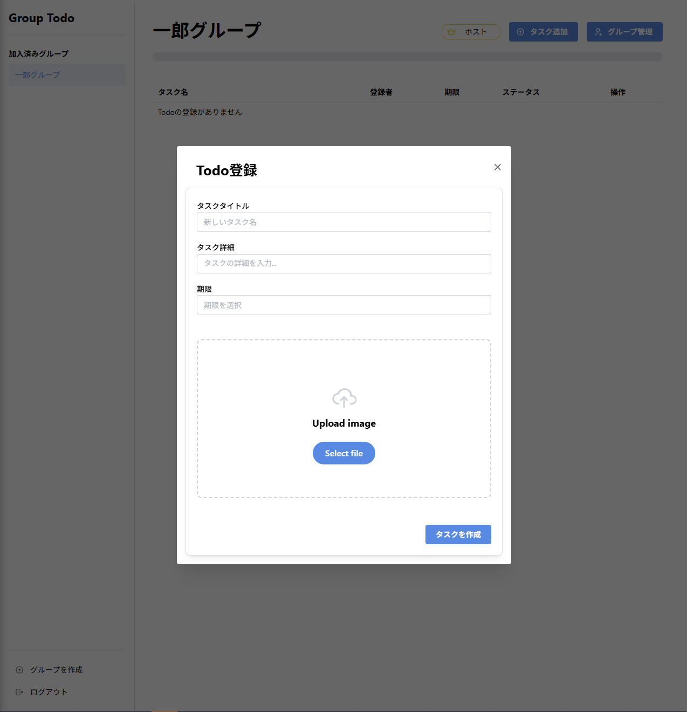
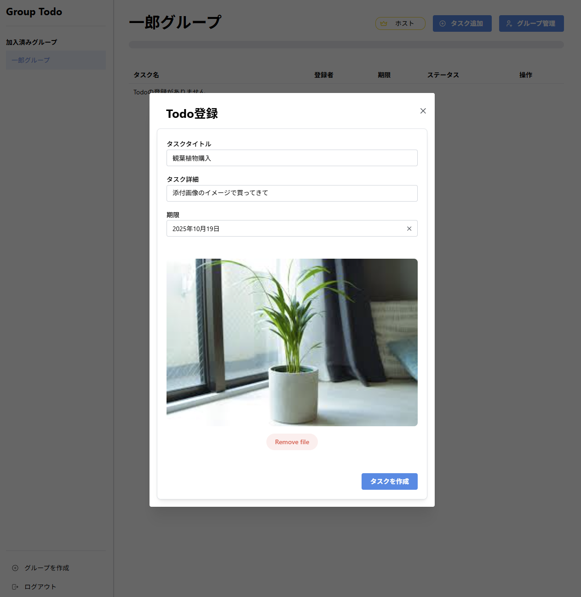
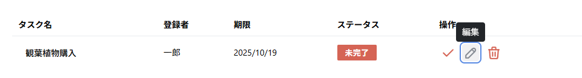
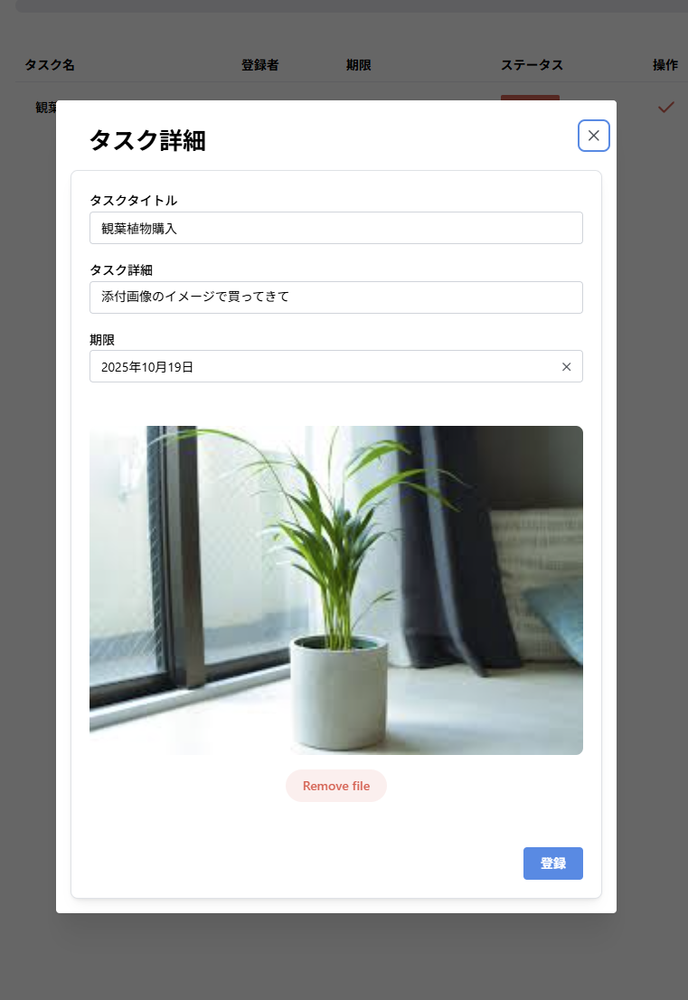
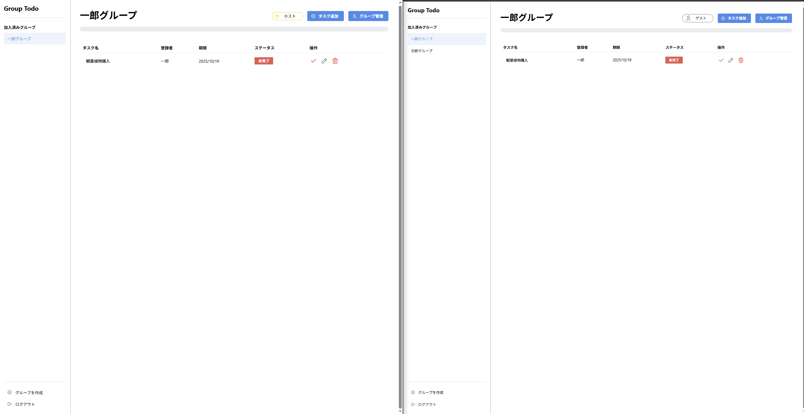
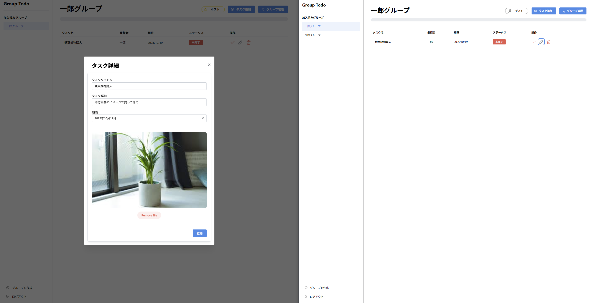
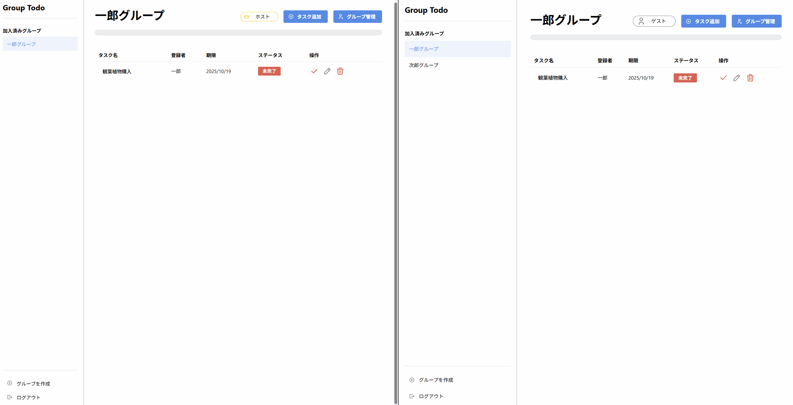
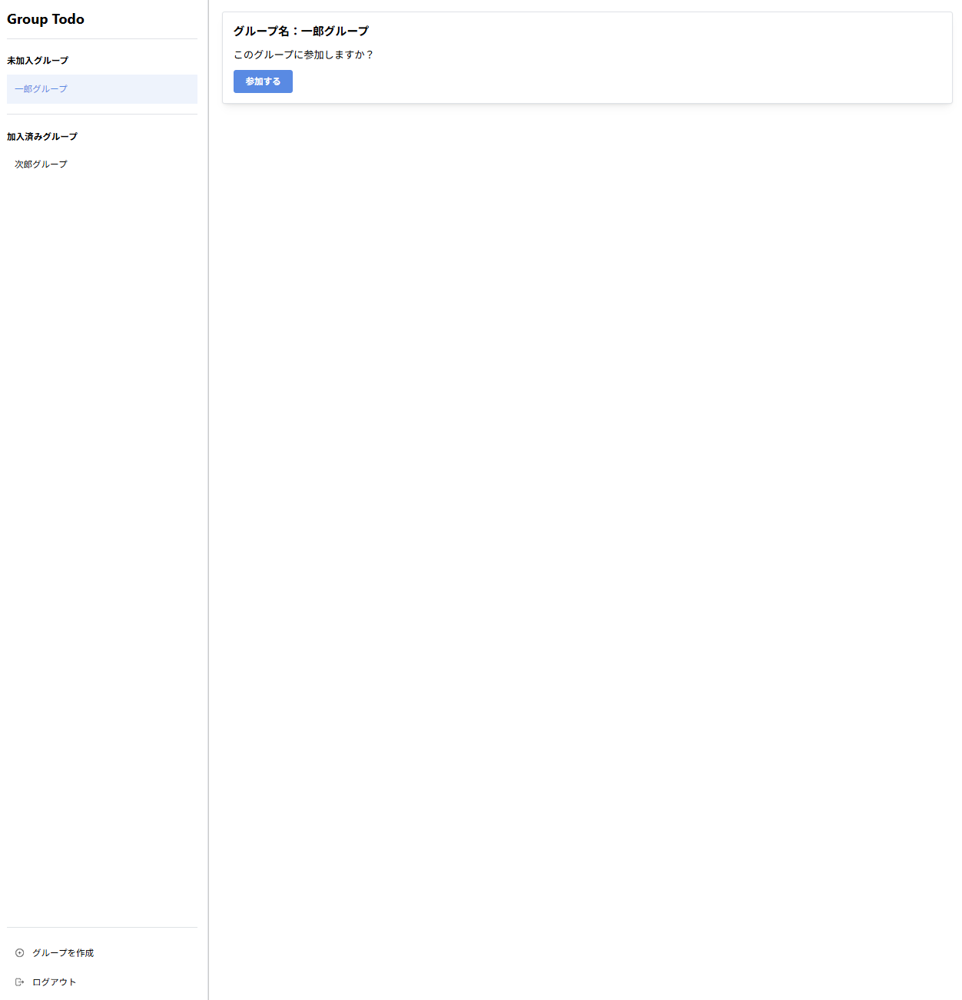
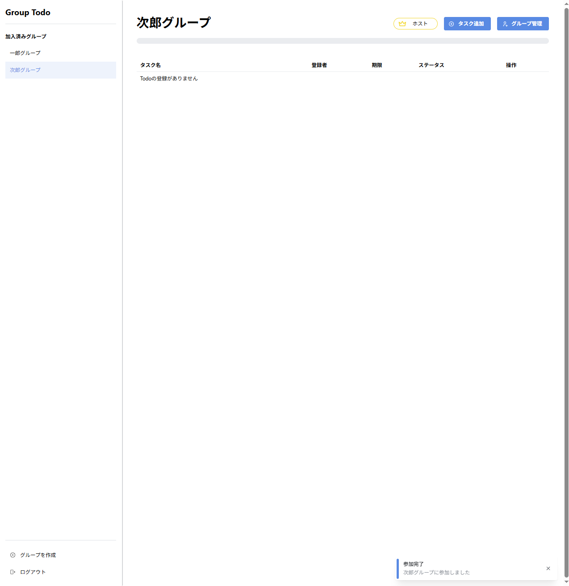

# GroupTodo - Laravel + Vite + React

<br>
<br>

# 概要

自己のスキルアップの為にGroupで共有するTodoアプリを作成しました。

<br>
<br>

# 主な追加機能

* 画像添付（MinIOにアップロード）
* グループ招待制度
* Todo編集時の排他制御
* 画面内通知


## 画像添付（MinIOにアップロード）
- フォームはmantineの「Dropzone」コンポーネントを使用、参照はmantine UI
- fileを送信してminIOに送信
- 表示時はbase64に変換してフロントに渡して表示
  - 直接URLが知られない、jsonでフロントに返せるため
#### 躓きポイント
- minIOの読み方が'ミニオ'かと思っていたが'ミンアイオー'とのこと
- .envでminioの接続設定を行ったが、docker-compose.ymlでも設定を行っていた為、接続設定が重複していた。
  - envでバケット名を設定したが中々適用されず設定に時間を要した→docker-compose.yml修正で改善






#### 鉛筆マークで編集画面表示


↓



## Todo編集画面表示時の排他制御(楽観ロック)

- 「todos」テーブルに「lock_time」と「lock_user_id」カラムを設定した。
- todoの編集フォーム(モーダル)を開くときに「オープン」or「クローズ」のフラグを合わせて送りオープンの時はロック、クローズの時はロック解除の制御を行った。
- ロック時間は30分、ロック中に編集画面を他のユーザーが開くと、ロックされている旨の表示を行う。

```排他制御部
public function updateLock(Request $request, $id)
    {
        try {
            $todo = Todo::find($id);
            $user = Auth::user();
            $opened = $request->boolean('opened');
            $is_lock_user = $todo->lock_user_id === $user->id;
            // 編集モーダルオープン時
            if ($opened) {
                if (!($todo->lock_time) || $todo->lock_time->diffInMinutes(now()) > 30 || $is_lock_user) {
                    // 排他ロック登録
                    $todo->lock_time = now();
                    $todo->lock_user_id = Auth::id();
                    $todo->save();
                    return response()->json(['is_lock' => false, 'lock_user' => $user->name], 201);
                } else {
                    // 排他ロック制御
                    $lock_user = User::find($todo->lock_user_id);
                    return response()->json(['is_lock' => true, 'lock_user' => $lock_user->name], 423);
                }
                // ロックユーザーがモーダルをクローズ
            } else if ($is_lock_user) {
                $todo->lock_time = null;
                $todo->lock_user_id = null;
                $todo->save();
                return response()->json(['is_lock' => false, 'lock_user' => ''], 201);
            }
            return
        } catch (\Throwable $e) {
            return response()->json(['message' => $e->getMessage()], 400);
        }
    }
```







## グループ招待

- 招待されるとサイドバーに未加入グループが表示されるようになります。
- 参加するボタンを押下することでtodoを共有できるようになります。
- アプリ内各所にmantineの通知を表示するようにしています。(画面右下表示)






## その他プログレスバー